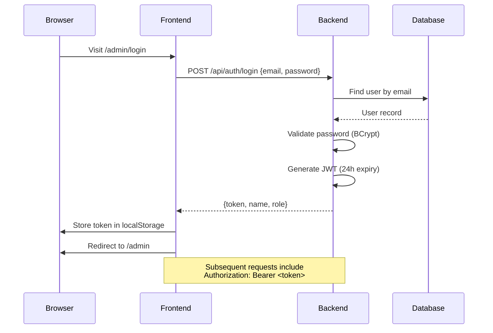
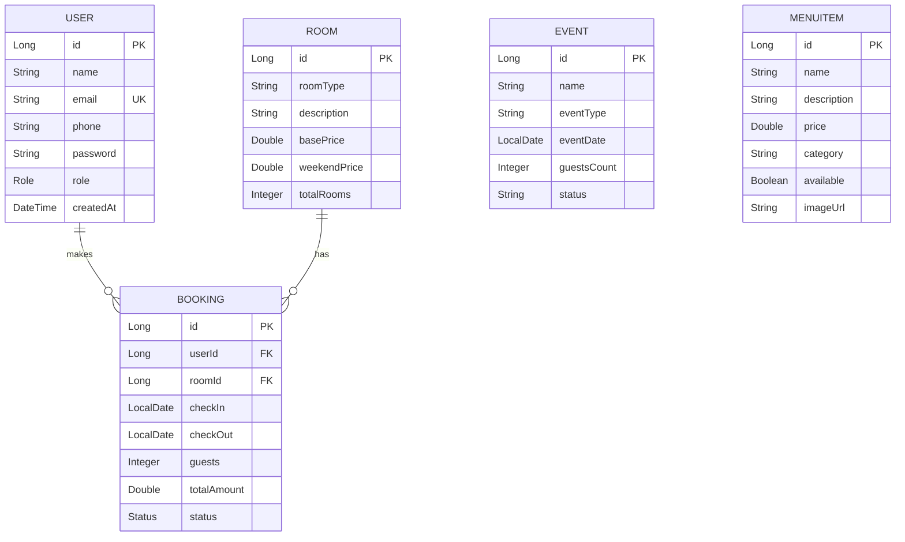

# Garden View Resort — Project Documentation

## Overview
A full-stack resort booking and management system built with **React (Vite)** frontend and **Spring Boot** backend.

---

## Tech Stack

| Layer | Technology |
|-------|-----------|
| Frontend | React 18, Vite, React Router, Lucide Icons |
| Backend | Spring Boot 3.2.3, Java 17, Maven |
| Database | H2 (dev) / MySQL (production) |
| Auth | Spring Security + JWT (jjwt 0.11.5) |
| ORM | Spring Data JPA (Hibernate) |
| Email | Spring Boot Starter Mail (Gmail SMTP) |
| Styling | Vanilla CSS |

---

## Project Structure

```
Garden view/
├── src/                          # React Frontend
│   ├── App.jsx                   # Router & layout
│   ├── main.jsx                  # Entry point
│   ├── index.css                 # Global styles
│   ├── components/
│   │   ├── Navbar.jsx / .css     # Navigation bar
│   │   └── Footer.jsx / .css     # Footer
│   ├── pages/
│   │   ├── Home.jsx / .css       # Landing page
│   │   ├── Rooms.jsx             # Room listings
│   │   ├── Restaurant.jsx        # Restaurant page
│   │   ├── Events.jsx            # Events page
│   │   ├── Amenities.jsx         # Amenities page
│   │   ├── Contact.jsx           # Contact form
│   │   ├── BookingSystem.jsx     # Booking flow
│   │   ├── AdminLogin.jsx / .css # Admin login
│   │   ├── AdminDashboard.jsx / .css # Admin panel
│   │   └── Common.css            # Shared styles
│   └── constants/
│       └── images.js             # Image paths
│
├── backend/                      # Spring Boot Backend
│   └── src/main/java/com/gardenview/
│       ├── GardenViewApplication.java
│       ├── config/
│       │   └── CorsConfig.java
│       ├── controller/
│       │   ├── AuthController.java      # Login, setup-admin
│       │   ├── AdminController.java     # Bookings, revenue, events
│       │   ├── BookingController.java   # Public booking API
│       │   ├── EventController.java     # Event inquiries
│       │   ├── MenuController.java      # Menu CRUD
│       │   └── RoomController.java      # Room listing + admin update
│       ├── dto/
│       │   ├── LoginRequest.java
│       │   ├── AuthResponse.java
│       │   ├── BookingRequestDTO.java
│       │   └── BookingResponseDTO.java
│       ├── model/
│       │   ├── User.java         # ADMIN / CUSTOMER roles
│       │   ├── Room.java         # Room types, pricing
│       │   ├── Booking.java      # Reservations
│       │   ├── Event.java        # Event inquiries
│       │   └── MenuItem.java     # Restaurant menu
│       ├── repository/           # JPA repositories (5)
│       ├── service/
│       │   ├── BookingService.java
│       │   ├── EventService.java
│       │   ├── EmailService.java
│       │   └── GstService.java
│       ├── security/
│       │   ├── JwtUtil.java
│       │   ├── JwtAuthenticationFilter.java
│       │   ├── CustomUserDetailsService.java
│       │   └── SecurityConfig.java
│       └── exception/
│           └── GlobalExceptionHandler.java
```

---

## API Reference

### Public Endpoints (No Auth Required)

| Method | Endpoint | Description |
|--------|----------|-------------|
| POST | `/api/auth/login` | Login → returns JWT |
| POST | `/api/auth/setup-admin` | Create primary admin |
| GET | `/api/rooms` | List all rooms |
| POST | `/api/bookings` | Create a booking |
| POST | `/api/events` | Submit event inquiry |
| GET | `/api/menu` | List menu items |
| GET | `/api/menu/category/{cat}` | Filter menu by category |

### Admin Endpoints (JWT Required, ADMIN role)

| Method | Endpoint | Description |
|--------|----------|-------------|
| GET | `/admin/bookings` | All bookings |
| PUT | `/admin/bookings/{id}/confirm` | Confirm booking |
| PUT | `/admin/bookings/{id}/cancel` | Cancel booking |
| GET | `/admin/events` | All event inquiries |
| GET | `/admin/revenue/monthly` | Revenue summary |
| PUT | `/api/rooms/admin/{id}` | Update room details |
| POST | `/api/menu/admin` | Add menu item |
| PUT | `/api/menu/admin/{id}` | Update menu item |
| DELETE | `/api/menu/admin/{id}` | Delete menu item |

---

## Authentication Flow



---

## Database Entities



---

## Running the Project

### Prerequisites
- **Node.js** 18+ and npm
- **Java 17+** and Maven
- **MySQL 8+** (for production)

### Frontend
```bash
cd "Garden view"
npm install
npm run dev          # → http://localhost:5173
```

### Backend
```bash
cd "Garden view/backend"
mvn spring-boot:run  # → http://localhost:8080
```

### First-Time Admin Setup
1. Start both frontend and backend
2. Navigate to `http://localhost:5173/admin/login`
3. Click **"Initialize Admin Account"**
4. Login with:
   - Email: `gardenviewresort2026@gmail.com`
   - Password: `gardenviewadmin26`

---

## Configuration

### Database (application.properties)
**Current: H2 (in-memory, for development)**
```properties
spring.datasource.url=jdbc:h2:mem:gardenview;DB_CLOSE_DELAY=-1
spring.datasource.driverClassName=org.h2.Driver
```

**Production: MySQL**
```properties
spring.datasource.url=jdbc:mysql://localhost:3306/gardenview_db?createDatabaseIfNotExist=true
spring.datasource.username=root
spring.datasource.password=root
spring.datasource.driver-class-name=com.mysql.cj.jdbc.Driver
```

### Email (Gmail SMTP)
```properties
spring.mail.host=smtp.gmail.com
spring.mail.port=587
spring.mail.username=gardenviewresort2026@gmail.com
spring.mail.password=<YOUR_APP_PASSWORD>
```

---

## Frontend Routes

| Route | Component | Auth? |
|-------|-----------|-------|
| `/` | Home | No |
| `/rooms` | Rooms | No |
| `/restaurant` | Restaurant | No |
| `/events` | Events | No |
| `/amenities` | Amenities | No |
| `/contact` | Contact | No |
| `/booking` | BookingSystem | No |
| `/admin/login` | AdminLogin | No |
| `/admin` | AdminDashboard | Yes (JWT) |

---

## Admin Dashboard Tabs

| Tab | Data Source | Actions |
|-----|------------|---------|
| Overview | `/admin/revenue/monthly`, `/admin/bookings`, `/admin/events` | View stats |
| Bookings | `/admin/bookings` | Confirm / Cancel |
| Room Management | `/api/rooms` | Edit prices, capacity → PUT |
| Restaurant Menu | `/api/menu` | Add / Delete items |
| Inquiries | `/admin/events` | View event submissions |

---

## Security Configuration

- **CSRF**: Disabled (stateless JWT)
- **Session**: Stateless
- **Public routes**: `/api/auth/**`, `/api/rooms`, `/api/bookings`, `/api/events`
- **Protected**: `/admin/**` requires `ROLE_ADMIN`
- **All other routes**: Require authentication
- **Password encoding**: BCrypt
- **JWT signing**: HMAC-SHA256, 24-hour expiry
